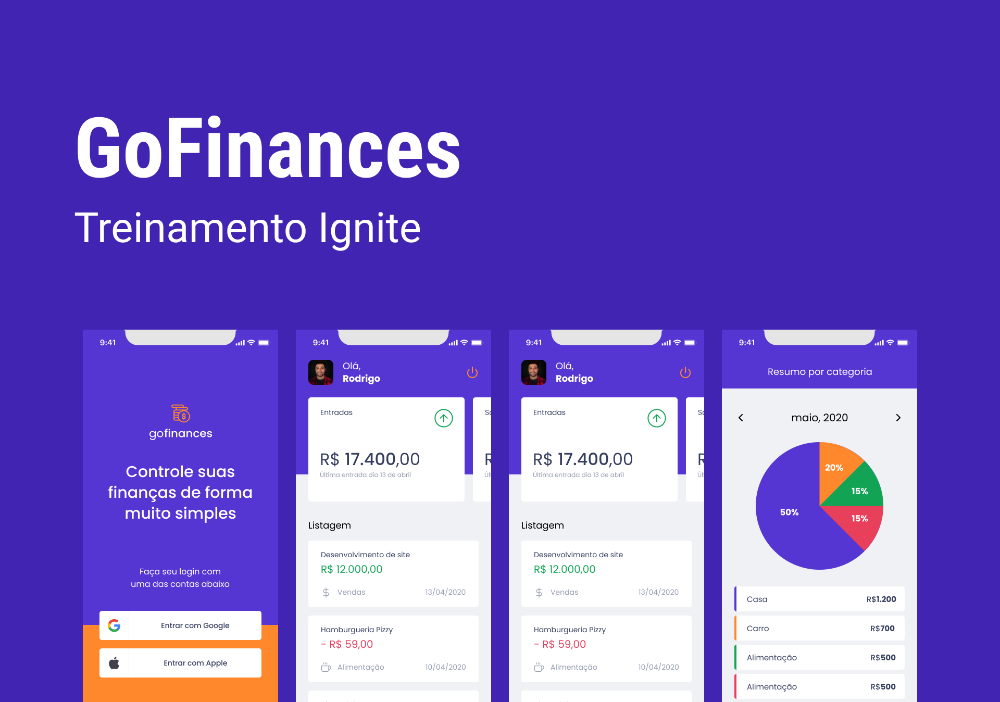
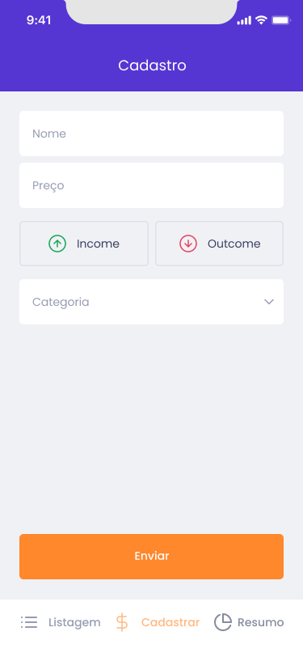
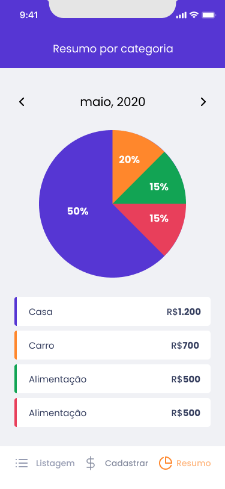

--- 

## 💻 Sobre o projeto

💰 gofinances - é uma aplicação que permite ao usuário ter nas palmas das suas mãos um resumo completo das suas movimentações financeiras à qualquer momento.

Projeto desenvolvido durante o Chapter II da trilha de React Native do bootcamp [Ignite](https://www.rocketseat.com.br/ignite). 

--- 

## 🎨 Layout

<div align="center">
  <div>
    <span>
      
    <span>
    <span>
      
    </span>
  </div>
  <div>
    <span>
      
    </span>
    <span>
      
    </span>
  </div>
</div>

--- 

## 🧭 Rodando a aplicação localmente

```bash

# Passo 1: Clone este repositório
$ git clone git@github.com:sou-gabriel/gofinances.git

# Passo 2: Acese a pasta do projeto no seu terminal
$ cd gofinances

# Passo 3: Instale todas as dependências do projeto
$ yarn

# Passo 4: Você deverá criar um arquivo .env na raiz da aplicação seguindo as variáveis ambientes declaradas no arquivo .env.example. Você deverá criar um projeto no Google Cloud Platform para obter tais informações que servem para a autenticação do usuário nos serviços Google.

# Passo 5: Execute a aplicação
$ expo start

# Após ter executado a aplicação você pode seguir as instruções geradas pelo próprio Expo no seu terminal para rodar a aplicação no seu emulador ou dispositivo físico.
```

---

## 🛠 Tecnologias

As seguintes ferramentas foram usadas na construção do projeto.

-   **[Expo](https://expo.dev/)**
-   **[React Native](https://reactnative.dev/)**
-   **[TypeScript](https://www.typescriptlang.org/)**
-   **[Styled Components](https://styled-components.com/)**
-   **[React Navigation](https://reactnavigation.org/)**
-   **[React Hook Form](https://react-hook-form.com/)**
-   **[Yup](https://github.com/jquense/yup)**
-   **[Date-fns](https://date-fns.org/)**
-   **[Victory Native](https://formidable.com/open-source/victory/docs/native/)**

---

⌨️ com ❤️ por [Gabriel Ramos Nogueira](https://www.linkedin.com/in/sou-gabriel/) 😊